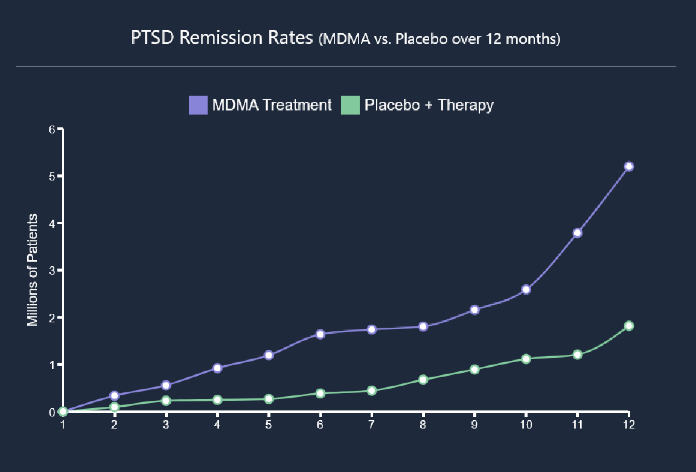

# MDMA vs Placebo for PTSD treatment

Inspired by a recent [5 bullet Friday Newsletter](https://go.tim.blog/5-bullet-friday-1/) I wanted to chart out the difference in PTSD remission outcomes between MDMA and Placebo. The data is from a [recent group of scientist](https://www.scientiststatementonptsd.com/) promoting the efficacy of MDMA for PTSD treatment.

As the chart highlights, you are 2.8 times more likely to go into remission with MDMA than with a placebo. (40% vs 15% respectively).

